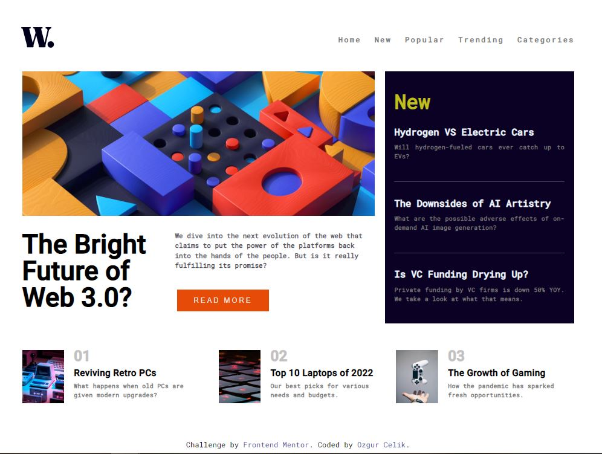
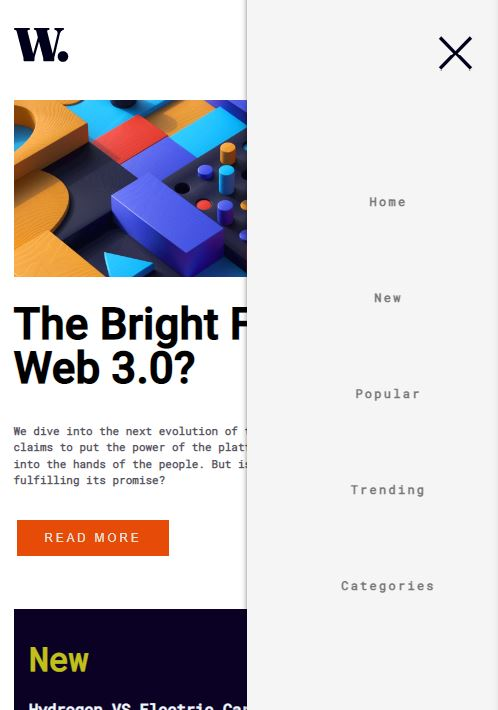
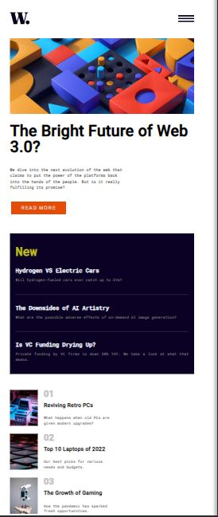

# Frontend Mentor - News homepage solution

This is a solution to the [News homepage challenge on Frontend Mentor](https://www.frontendmentor.io/challenges/news-homepage-H6SWTa1MFl). Frontend Mentor challenges help you improve your coding skills by building realistic projects. 

## Table of contents

- [Overview](#overview)
  - [The challenge](#the-challenge)
  - [Screenshot](#screenshot)
  - [Links](#links)
- [My process](#my-process)
  - [Built with](#built-with)
  - [What I learned](#what-i-learned)
  - [Continued development](#continued-development)
  - [Useful resources](#useful-resources)
- [Author](#author)


## Overview

This Project was created with HTML,CSS and JS by me

### The challenge

Users should be able to:

- View the optimal layout for the interface depending on their device's screen size
- See hover and focus states for all interactive elements on the page
-Flexible Menu


### Screenshot




 |  


### Links

- Solution URL: https://website-git-master-ozgurcc1.vercel.app/


## My process

Firstly, I selected the Junior project for advance then I created for this project file. I set up semantic HTML and upon writing CSS, tried to develop the right way step by step. Furthermore, I notched my HTML page with CSS and JS so that I set up a flexible menu. 

### Built with

- Semantic HTML5 markup
- CSS custom properties
- Flexbox
- CSS Grid
- Mobile-first workflow
- Javascript

### What I learned

I set to flex, Grid, BEM Methodologies and exactly background.

```html
<div class="games">

    <div class="games__row">
      

       <div class="games__news games__news--value">
        <div class="games__news--number">01</div>
        <a class="games__news--pc">Reviving Retro PCs</a>
        <p class="games__retro--sort">What happens when old PCs are given modern upgrades?</p>
       </div>
    </div>
```
```css
.games{

  grid-column-start:1;
  grid-column-end: 4;
  grid-row-start: 2;
  grid-row-end: 3;
  column-gap: 1.0rem;
  
  /* Flex Games */
  display: flex;
  flex-direction: row;
  justify-content:space-between;
  justify-self: center;
  
}
```
```js
navToggle.addEventListener("click", () =>{
    const visibility = primaryNav.getAttribute('data-visible')
    if(visibility === "false"){
        primaryNav.setAttribute('data-visible', true);
        navToggle.setAttribute('aria-expanded', true);
        
    }else if(visibility === "true"){
        primaryNav.setAttribute('data-visible',false);
        navToggle.setAttribute('aria-expanded', false);
        
    }

});
```


### Continued development

I want to try "text animation effects", javascript, UI and grid system in the future on the level phase.

### Useful resources

- [Example resource 1](https://www.youtube.com/watch?v=HbBMp6yUXO0) - This helped me with the Flexible menu reason. I really liked this pattern and again can use it going forward.
- [Example resource 2](https://csswizardry.com/2013/01/mindbemding-getting-your-head-round-bem-syntax/) - This is an amazing article that helped me finally understand BEM syntax. I'd recommend it to anyone still learning this concept. But, I could have been not using this project for BEM Methodology. Because my project is small and immediately can make a test. this was a great opportunity to try.


## Author

- Website - [Özgür Çelik](https://ozgurcelik.hashnode.dev/)
- Frontend Mentor - [@yourusername](https://www.frontendmentor.io/profile/yourusername)
- Github - [@ozgurcc1](https://github.com/ozgurcc1)


